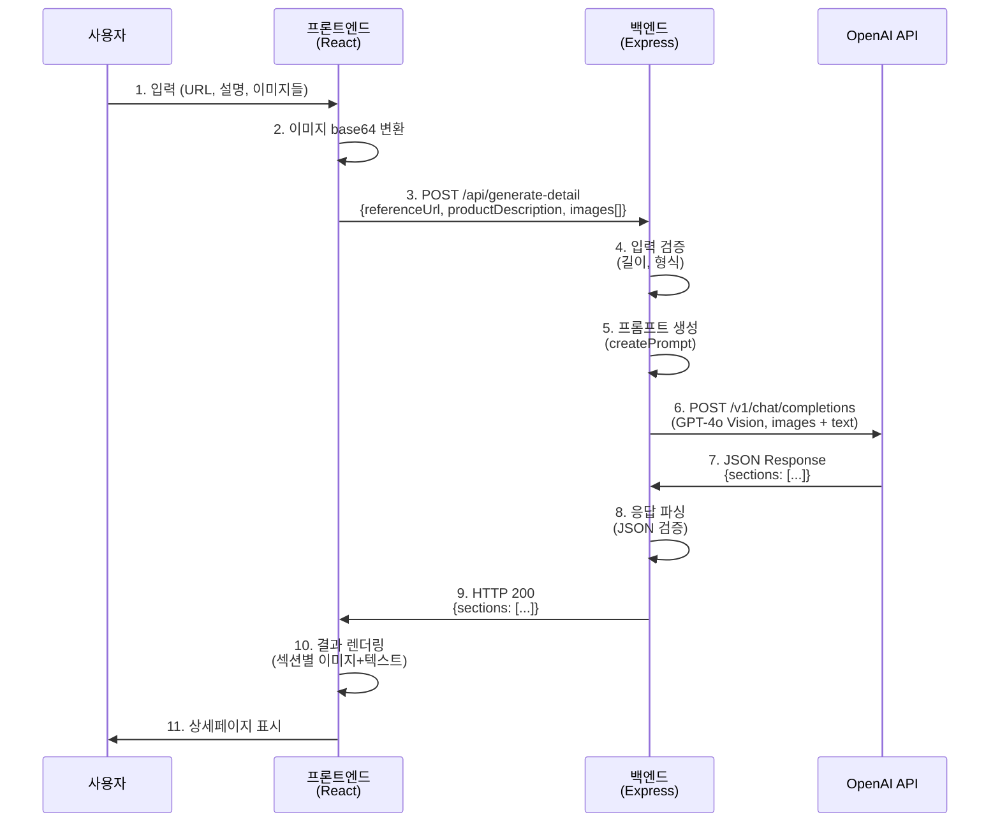
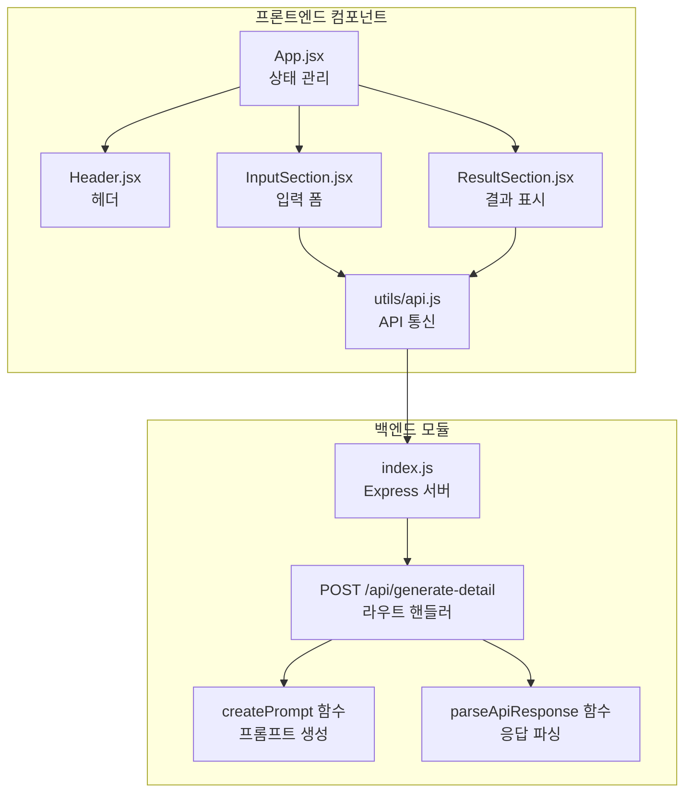
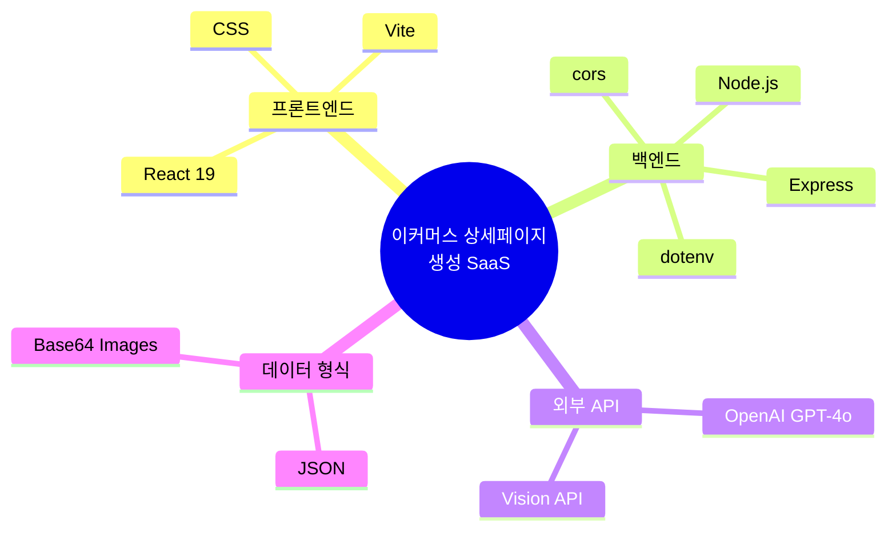

# 시스템 아키텍처 다이어그램

## 전체 시스템 아키텍처

```mermaid
flowchart TD
    subgraph "Client Layer"
        User[사용자]
        Browser[웹 브라우저<br/>localhost:5173]
    end

    subgraph "Frontend Layer"
        React[React App<br/>Vite]
        InputSection[InputSection<br/>입력 UI]
        ResultSection[ResultSection<br/>결과 표시]
        APIUtils[API Utils<br/>HTTP Client]
    end

    subgraph "Backend Layer"
        Express[Express Server<br/>localhost:3000]
        APIRoute[/api/generate-detail<br/>POST Endpoint]
        PromptGen[Prompt Generator<br/>프롬프트 생성]
        ResponseParser[Response Parser<br/>JSON 파싱]
    end

    subgraph "External Services"
        OpenAI[OpenAI API<br/>GPT-4o Vision]
    end

    subgraph "Data Flow"
        InputData[입력 데이터<br/>- referenceUrl<br/>- productDescription<br/>- images]
        OutputData[출력 데이터<br/>- sections array<br/>  - headline<br/>  - body]
    end

    %% User interactions
    User -->|입력| InputSection
    ResultSection -->|결과 표시| User

    %% Frontend internal flow
    InputSection -->|상품 정보| APIUtils
    APIUtils -->|HTTP POST<br/>JSON| Express
    Express -->|JSON Response| APIUtils
    APIUtils -->|결과 데이터| ResultSection

    %% Backend processing
    Express -->|요청 처리| APIRoute
    APIRoute -->|검증된 입력| PromptGen
    PromptGen -->|프롬프트 생성| APIRoute
    APIRoute -->|HTTP POST<br/>JSON + Images| OpenAI
    OpenAI -->|JSON Response| APIRoute
    APIRoute -->|원본 응답| ResponseParser
    ResponseParser -->|파싱된 섹션 배열| Express

    %% Data transformations
    InputData -.->|전송| APIUtils
    OutputData -.->|수신| APIUtils

    %% Styling
    classDef frontend fill:#61dafb,stroke:#20232a,stroke-width:2px,color:#000
    classDef backend fill:#339933,stroke:#0d2818,stroke-width:2px,color:#fff
    classDef external fill:#ff6b6b,stroke:#8b0000,stroke-width:2px,color:#fff
    classDef data fill:#ffd93d,stroke:#b8860b,stroke-width:2px,color:#000

    class React,InputSection,ResultSection,APIUtils frontend
    class Express,APIRoute,PromptGen,ResponseParser backend
    class OpenAI external
    class InputData,OutputData data
```

## 데이터 흐름 상세



## 컴포넌트 구조



## 기술 스택


