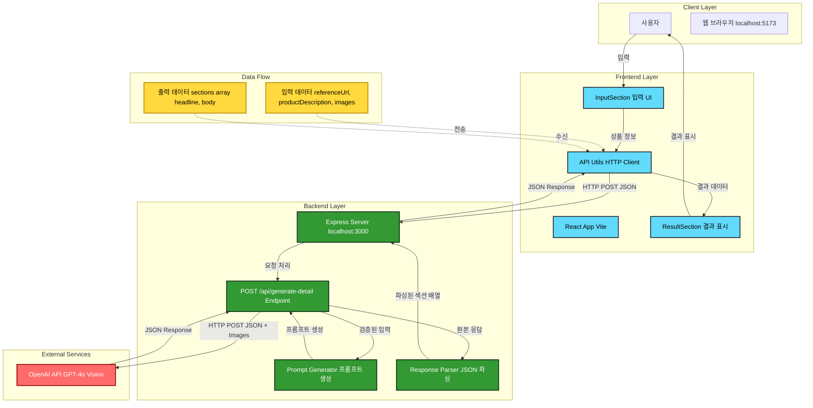
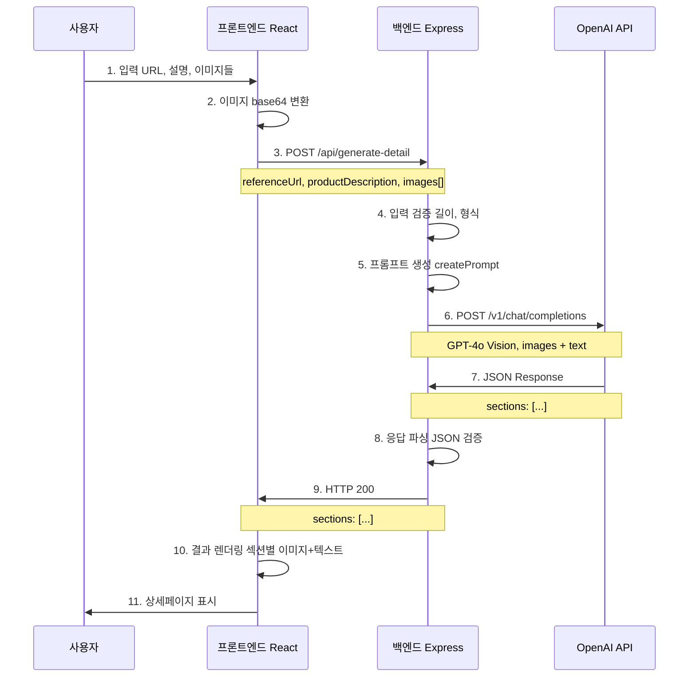
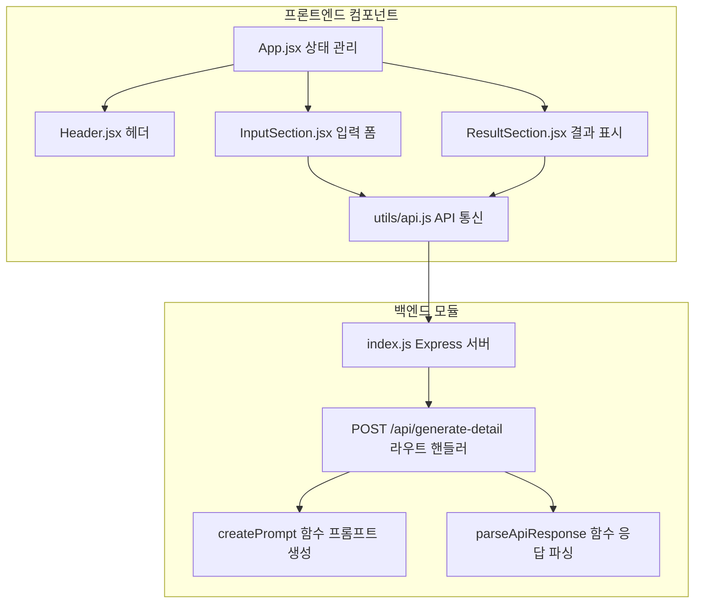
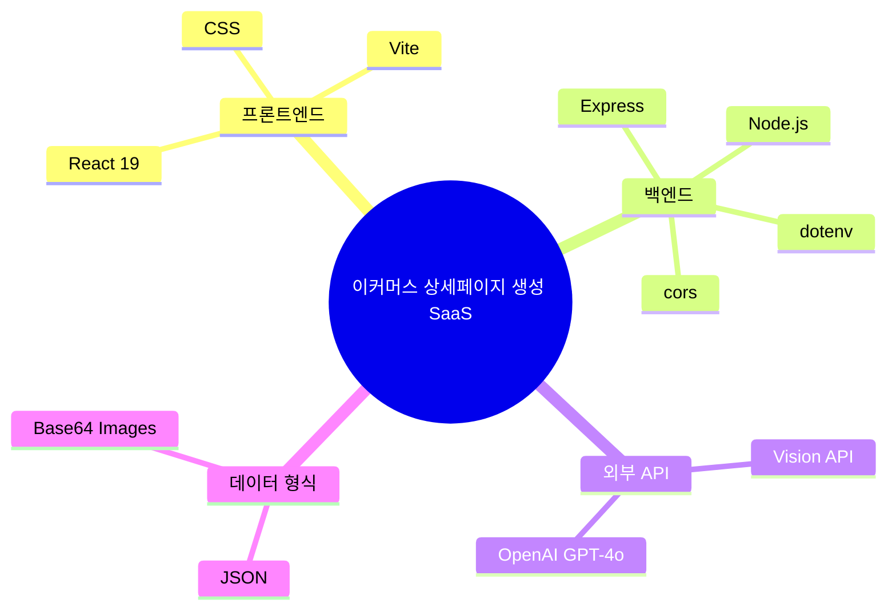

# 시스템 아키텍처 다이어그램

## 전체 시스템 아키텍처

```mermaid
flowchart TD
    subgraph Client["Client Layer"]
        User[사용자]
        Browser["웹 브라우저 localhost:5173"]
    end

    subgraph Frontend["Frontend Layer"]
        React["React App Vite"]
        InputSection["InputSection 입력 UI"]
        ResultSection["ResultSection 결과 표시"]
        APIUtils["API Utils HTTP Client"]
    end

    subgraph Backend["Backend Layer"]
        Express["Express Server localhost:3000"]
        APIRoute["POST /api/generate-detail Endpoint"]
        PromptGen["Prompt Generator 프롬프트 생성"]
        ResponseParser["Response Parser JSON 파싱"]
    end

    subgraph External["External Services"]
        OpenAI["OpenAI API GPT-4o Vision"]
    end

    subgraph DataFlow["Data Flow"]
        InputData["입력 데이터 referenceUrl, productDescription, images"]
        OutputData["출력 데이터 sections array headline, body"]
    end

    User -->|입력| InputSection
    ResultSection -->|결과 표시| User

    InputSection -->|상품 정보| APIUtils
    APIUtils -->|HTTP POST JSON| Express
    Express -->|JSON Response| APIUtils
    APIUtils -->|결과 데이터| ResultSection

    Express -->|요청 처리| APIRoute
    APIRoute -->|검증된 입력| PromptGen
    PromptGen -->|프롬프트 생성| APIRoute
    APIRoute -->|HTTP POST JSON + Images| OpenAI
    OpenAI -->|JSON Response| APIRoute
    APIRoute -->|원본 응답| ResponseParser
    ResponseParser -->|파싱된 섹션 배열| Express

    InputData -.->|전송| APIUtils
    OutputData -.->|수신| APIUtils

    classDef frontend fill:#61dafb,stroke:#20232a,stroke-width:2px,color:#000
    classDef backend fill:#339933,stroke:#0d2818,stroke-width:2px,color:#fff
    classDef external fill:#ff6b6b,stroke:#8b0000,stroke-width:2px,color:#fff
    classDef data fill:#ffd93d,stroke:#b8860b,stroke-width:2px,color:#000

    class React,InputSection,ResultSection,APIUtils frontend
    class Express,APIRoute,PromptGen,ResponseParser backend
    class OpenAI external
    class InputData,OutputData data
```

## 데이터 흐름 상세

```mermaid
sequenceDiagram
    participant U as 사용자
    participant FE as 프론트엔드 React
    participant BE as 백엔드 Express
    participant AI as OpenAI API

    U->>FE: 1. 입력 URL, 설명, 이미지들
    FE->>FE: 2. 이미지 base64 변환
    FE->>BE: 3. POST /api/generate-detail
    Note over FE,BE: referenceUrl, productDescription, images[]
    BE->>BE: 4. 입력 검증 길이, 형식
    BE->>BE: 5. 프롬프트 생성 createPrompt
    BE->>AI: 6. POST /v1/chat/completions
    Note over BE,AI: GPT-4o Vision, images + text
    AI->>BE: 7. JSON Response
    Note over AI,BE: sections: [...]
    BE->>BE: 8. 응답 파싱 JSON 검증
    BE->>FE: 9. HTTP 200
    Note over BE,FE: sections: [...]
    FE->>FE: 10. 결과 렌더링 섹션별 이미지+텍스트
    FE->>U: 11. 상세페이지 표시
```

## 컴포넌트 구조

```mermaid
graph TB
    subgraph FrontendComponents["프론트엔드 컴포넌트"]
        App["App.jsx 상태 관리"]
        Header["Header.jsx 헤더"]
        InputSection2["InputSection.jsx 입력 폼"]
        ResultSection2["ResultSection.jsx 결과 표시"]
        APIUtils2["utils/api.js API 통신"]
    end

    subgraph BackendModules["백엔드 모듈"]
        Server["index.js Express 서버"]
        Route["POST /api/generate-detail 라우트 핸들러"]
        Prompt["createPrompt 함수 프롬프트 생성"]
        Parser["parseApiResponse 함수 응답 파싱"]
    end

    App --> Header
    App --> InputSection2
    App --> ResultSection2
    InputSection2 --> APIUtils2
    ResultSection2 --> APIUtils2
    APIUtils2 --> Server
    Server --> Route
    Route --> Prompt
    Route --> Parser
```

## 기술 스택

```mermaid
mindmap
  root((이커머스 상세페이지 생성 SaaS))
    프론트엔드
      React 19
      Vite
      CSS
    백엔드
      Node.js
      Express
      dotenv
      cors
    외부 API
      OpenAI GPT-4o
      Vision API
    데이터 형식
      JSON
      Base64 Images
```
