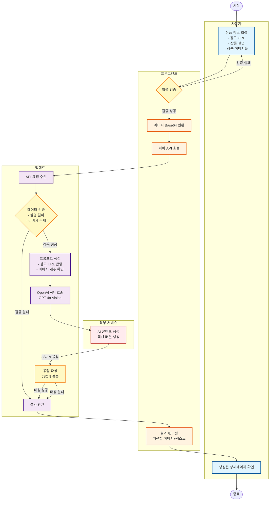
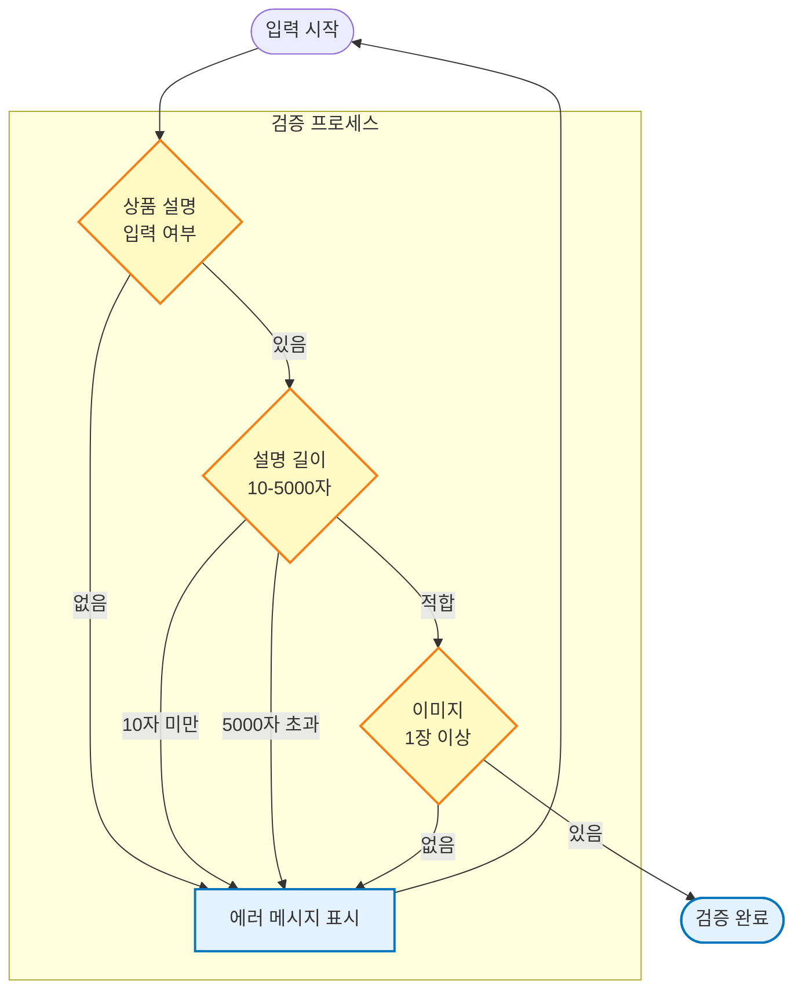
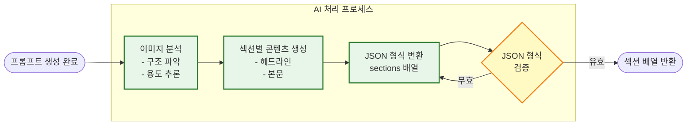
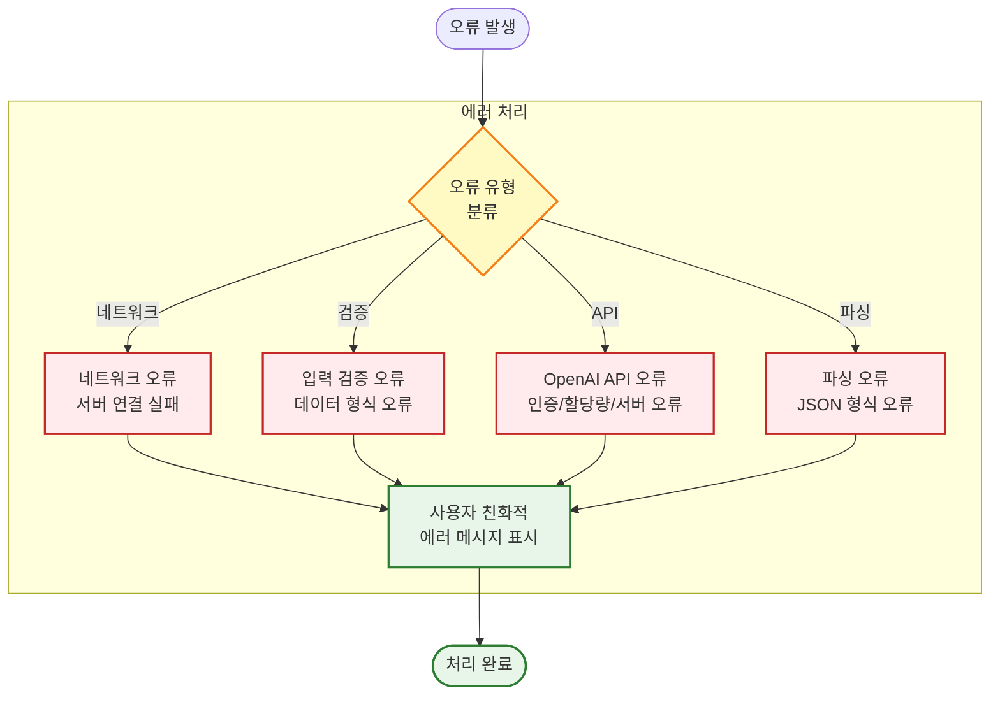

# 비즈니스 프로세스 다이어그램

## 상세페이지 생성 프로세스

```mermaid
flowchart TD
    Start([시작])
    End([종료])
    
    subgraph UserLane["사용자"]
        UserInput[상품 정보 입력<br/>- 참고 URL<br/>- 상품 설명<br/>- 상품 이미지들]
        ViewResult[생성된 상세페이지 확인]
    end
    
    subgraph FrontendLane["프론트엔드"]
        ValidateInput{입력 검증}
        ConvertImages[이미지 Base64 변환]
        SendRequest[서버 API 호출]
        RenderResult[결과 렌더링<br/>섹션별 이미지+텍스트]
    end
    
    subgraph BackendLane["백엔드"]
        ReceiveRequest[API 요청 수신]
        ValidateData{데이터 검증<br/>- 설명 길이<br/>- 이미지 존재}
        GeneratePrompt[프롬프트 생성<br/>- 참고 URL 반영<br/>- 이미지 개수 확인]
        CallOpenAI[OpenAI API 호출<br/>GPT-4o Vision]
        ParseResponse[응답 파싱<br/>JSON 검증]
        ReturnResult[결과 반환]
    end
    
    subgraph ExternalLane["외부 서비스"]
        ProcessAI[AI 콘텐츠 생성<br/>섹션 배열 생성]
    end
    
    Start --> UserInput
    UserInput --> ValidateInput
    
    ValidateInput -->|검증 실패| UserInput
    ValidateInput -->|검증 성공| ConvertImages
    
    ConvertImages --> SendRequest
    SendRequest --> ReceiveRequest
    
    ReceiveRequest --> ValidateData
    ValidateData -->|검증 실패| ReturnResult
    ValidateData -->|검증 성공| GeneratePrompt
    
    GeneratePrompt --> CallOpenAI
    CallOpenAI --> ProcessAI
    
    ProcessAI -->|JSON 응답| ParseResponse
    ParseResponse -->|파싱 성공| ReturnResult
    ParseResponse -->|파싱 실패| ReturnResult
    
    ReturnResult --> RenderResult
    RenderResult --> ViewResult
    ViewResult --> End
    
    classDef userStyle fill:#e1f5ff,stroke:#01579b,stroke-width:2px
    classDef frontendStyle fill:#fff3e0,stroke:#e65100,stroke-width:2px
    classDef backendStyle fill:#f3e5f5,stroke:#4a148c,stroke-width:2px
    classDef externalStyle fill:#ffebee,stroke:#b71c1c,stroke-width:2px
    classDef decisionStyle fill:#fff9c4,stroke:#f57f17,stroke-width:2px,shape:rhombus
    
    class UserInput,ViewResult userStyle
    class ValidateInput,ConvertImages,SendRequest,RenderResult frontendStyle
    class ReceiveRequest,ValidateData,GeneratePrompt,CallOpenAI,ParseResponse,ReturnResult backendStyle
    class ProcessAI externalStyle
    class ValidateInput,ValidateData,ParseResponse decisionStyle
```

## 입력 검증 프로세스

```mermaid
flowchart TD
    Start([입력 시작])
    End([검증 완료])
    
    subgraph Validation["검증 프로세스"]
        CheckDescription{상품 설명<br/>입력 여부}
        CheckLength{설명 길이<br/>10-5000자}
        CheckImages{이미지<br/>1장 이상}
        ShowError[에러 메시지 표시]
    end
    
    Start --> CheckDescription
    CheckDescription -->|없음| ShowError
    CheckDescription -->|있음| CheckLength
    
    CheckLength -->|10자 미만| ShowError
    CheckLength -->|5000자 초과| ShowError
    CheckLength -->|적합| CheckImages
    
    CheckImages -->|없음| ShowError
    CheckImages -->|있음| End
    
    ShowError --> Start
    
    classDef decisionStyle fill:#fff9c4,stroke:#f57f17,stroke-width:2px,shape:rhombus
    classDef processStyle fill:#e3f2fd,stroke:#0277bd,stroke-width:2px
    
    class CheckDescription,CheckLength,CheckImages decisionStyle
    class ShowError,End processStyle
```

## AI 콘텐츠 생성 프로세스

```mermaid
flowchart LR
    Start([프롬프트 생성 완료])
    End([섹션 배열 반환])
    
    subgraph AIProcess["AI 처리 프로세스"]
        AnalyzeImages[이미지 분석<br/>- 구조 파악<br/>- 용도 추론]
        GenerateSections[섹션별 콘텐츠 생성<br/>- 헤드라인<br/>- 본문]
        FormatOutput[JSON 형식 변환<br/>sections 배열]
        ValidateJSON{JSON 형식<br/>검증}
    end
    
    Start --> AnalyzeImages
    AnalyzeImages --> GenerateSections
    GenerateSections --> FormatOutput
    FormatOutput --> ValidateJSON
    ValidateJSON -->|유효| End
    ValidateJSON -->|무효| FormatOutput
    
    classDef processStyle fill:#e8f5e9,stroke:#2e7d32,stroke-width:2px
    classDef decisionStyle fill:#fff9c4,stroke:#f57f17,stroke-width:2px,shape:rhombus
    
    class AnalyzeImages,GenerateSections,FormatOutput processStyle
    class ValidateJSON decisionStyle
```

## 에러 처리 프로세스

```mermaid
flowchart TD
    Start([오류 발생])
    End([처리 완료])
    
    subgraph ErrorHandling["에러 처리"]
        ClassifyError{오류 유형<br/>분류}
        NetworkError[네트워크 오류<br/>서버 연결 실패]
        ValidationError[입력 검증 오류<br/>데이터 형식 오류]
        APIError[OpenAI API 오류<br/>인증/할당량/서버 오류]
        ParseError[파싱 오류<br/>JSON 형식 오류]
        UserMessage[사용자 친화적<br/>에러 메시지 표시]
    end
    
    Start --> ClassifyError
    ClassifyError -->|네트워크| NetworkError
    ClassifyError -->|검증| ValidationError
    ClassifyError -->|API| APIError
    ClassifyError -->|파싱| ParseError
    
    NetworkError --> UserMessage
    ValidationError --> UserMessage
    APIError --> UserMessage
    ParseError --> UserMessage
    
    UserMessage --> End
    
    classDef decisionStyle fill:#fff9c4,stroke:#f57f17,stroke-width:2px,shape:rhombus
    classDef errorStyle fill:#ffebee,stroke:#c62828,stroke-width:2px
    classDef processStyle fill:#e8f5e9,stroke:#2e7d32,stroke-width:2px
    
    class ClassifyError decisionStyle
    class NetworkError,ValidationError,APIError,ParseError errorStyle
    class UserMessage,End processStyle
```
